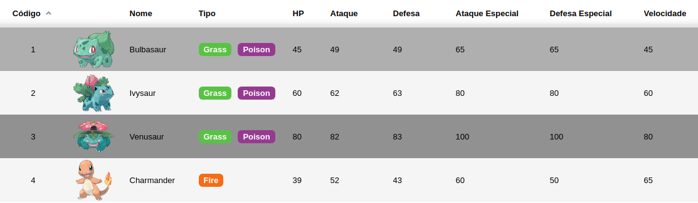

# Tabela virtual

Para lidar com grandes quantidades de dados, precisamos usar componente de tabela que lidam de forma eficiente e otimizada. Para isso criei um exemplo usando o componente [react-base-table](https://github.com/Autodesk/react-base-table). Ele é um componente ideal quando temos que carregar e navegar em uma grande quantidade de dados usando **tabela**.

Criei um [post](https://medium.com/@alexandreservian/react-usando-tabela-virtual-para-lidar-com-grandes-quantidades-de-dados-bade2f1c3b02) que complementa toda a ideia por traz deste assunto.

Você pode ver tambem o projeto online no [codesandbox](https://codesandbox.io/s/react-table-example-pokemon-p8fuh)



## Rodar o exemplo

Primeiro instale as dependências:
```shell
npm install
```

Para iniciar o exemplo basta:
```shell
npm start
```